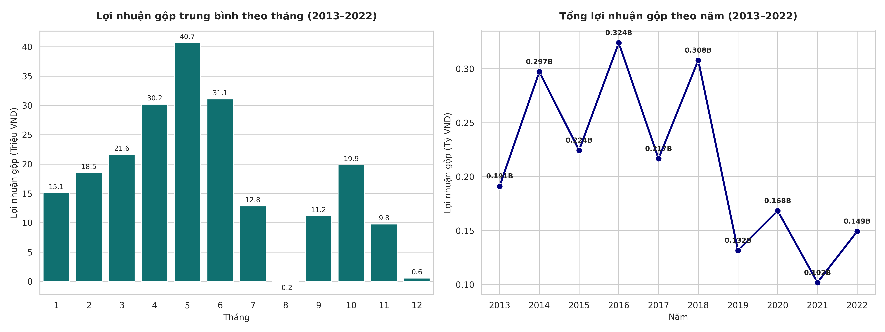
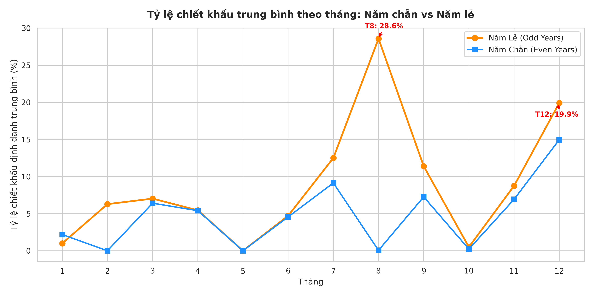
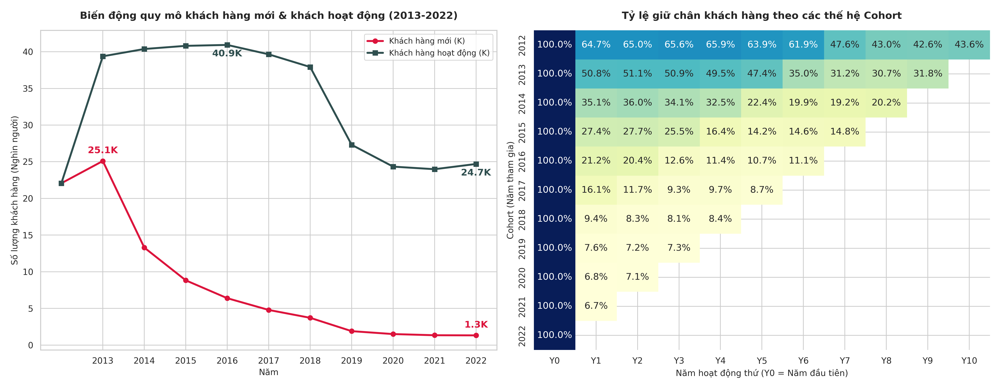
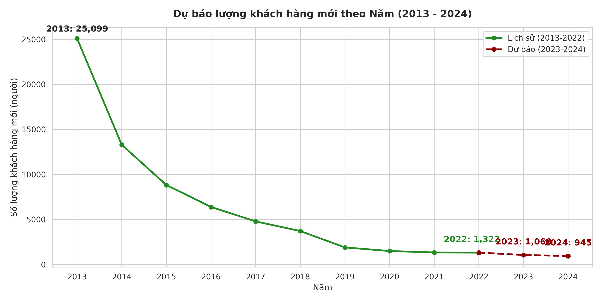
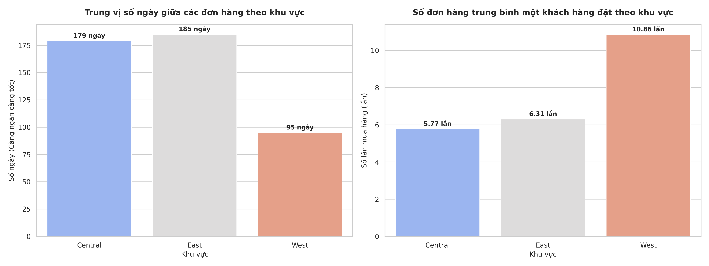
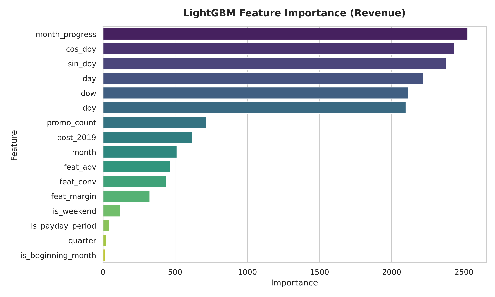
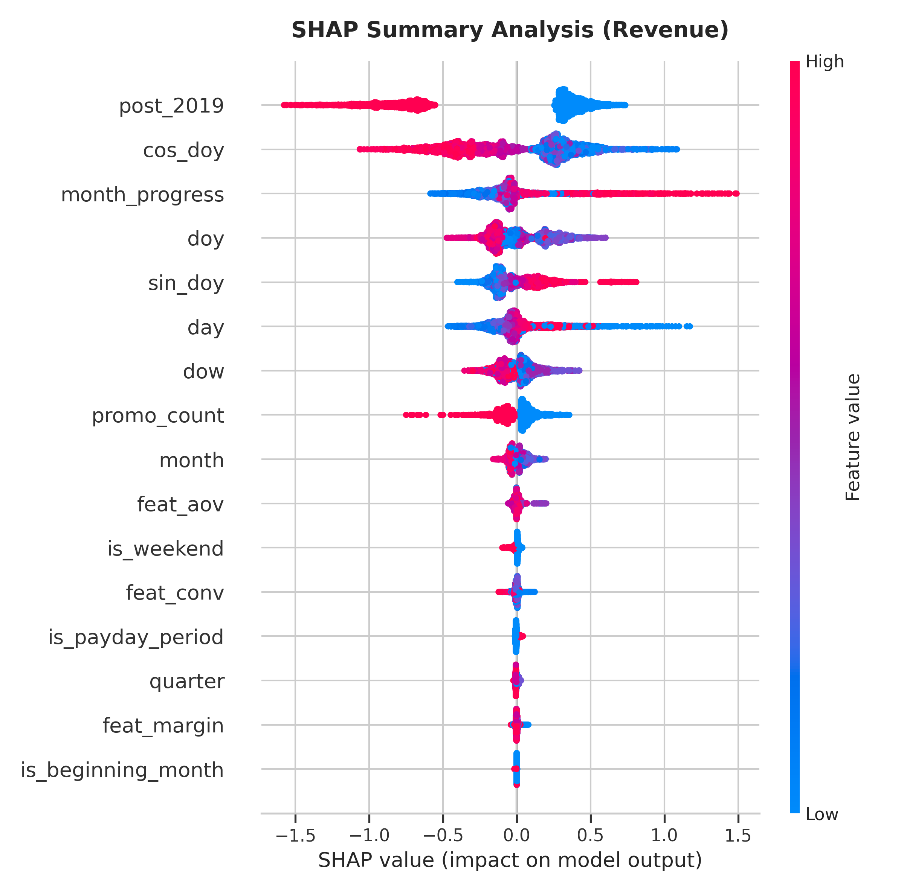

# Báo cáo Phân tích Lợi nhuận & Dự báo Doanh thu (Datathon VinUni 2026)
### Đội thi: NHLBike

[](https://www.python.org/)
[](https://lightgbm.readthedocs.io/)
[](https://github.com/shap/shap)
[](#)

Báo cáo giải pháp toàn diện này trình bày kết quả phân tích hành vi khách hàng, chẩn đoán nguyên nhân xói mòn lợi nhuận, và thiết lập mô hình học máy dự báo doanh thu và giá vốn (COGS) cho một doanh nghiệp thương mại điện tử thời trang. Dự án được cấu trúc theo chuẩn dự án Data Science tại các tập đoàn lớn.

---

## 📂 1. Cấu trúc Dự án (Enterprise Repository Directory)

Mã nguồn và tài nguyên được cấu trúc phân tầng rõ ràng để phục vụ triển khai thực tế (Production-ready):

* **[data/](file:///home/long/Documents/Datathon_Vinuni_2026/data/)**: Quản lý dữ liệu tập trung.
  * **[raw/](file:///home/long/Documents/Datathon_Vinuni_2026/data/raw/)**: Dữ liệu thô từ hệ thống (Bao gồm 14 bảng dữ liệu giao dịch, tồn kho và traffic).
  * **[submissions/](file:///home/long/Documents/Datathon_Vinuni_2026/data/submissions/)**: Chứa file kết quả dự báo đầu ra [submission.csv](file:///home/long/Documents/Datathon_Vinuni_2026/data/submissions/submission.csv).
* **[notebooks/](file:///home/long/Documents/Datathon_Vinuni_2026/notebooks/)**: Môi trường phân tích và huấn luyện.
  * **[01_eda_and_insights.ipynb](file:///home/long/Documents/Datathon_Vinuni_2026/notebooks/01_eda_and_insights.ipynb)**: Thực hiện phân tích chẩn đoán nghiệp vụ và kết xuất biểu đồ.
  * **[02_sales_forecasting.ipynb](file:///home/long/Documents/Datathon_Vinuni_2026/notebooks/02_sales_forecasting.ipynb)**: Pipeline LightGBM, trích xuất đặc trưng và dự báo doanh số.
* **[src/](file:///home/long/Documents/Datathon_Vinuni_2026/src/)**: Đóng gói các hàm cốt lõi dạng module tái sử dụng:
  * **[data_loader.py](file:///home/long/Documents/Datathon_Vinuni_2026/src/data_loader.py)**: Tải và đồng bộ dữ liệu.
  * **[features.py](file:///home/long/Documents/Datathon_Vinuni_2026/src/features.py)**: Kỹ nghệ đặc trưng, chuẩn hóa xu hướng.
  * **[models.py](file:///home/long/Documents/Datathon_Vinuni_2026/src/models.py)**: Thiết lập mô hình, kiểm định chéo và áp đặt ràng buộc tài chính.
* **[reports/](file:///home/long/Documents/Datathon_Vinuni_2026/reports/)**:
  * **[figures/](file:///home/long/Documents/Datathon_Vinuni_2026/reports/figures/)**: Chứa 7 hình vẽ kết xuất tự động phục vụ báo cáo.

---

## 📊 2. Phần 2 — Trực quan hóa & Phân tích Chẩn đoán (Diagnostic EDA)

### 2.1. Phân tích Lợi nhuận gộp & Tính chu kỳ (Hình 1)
Lợi nhuận gộp (Gross Profit) được tính bằng công thức: $\text{Gross Profit} = \text{Revenue} - \text{COGS}$. Qua phân tích lịch sử giai đoạn 2013–2022, chúng tôi phát hiện 2 quy luật rõ nét:
* **Tính mùa vụ**: Biểu đồ bên trái cho thấy lợi nhuận gộp đạt đỉnh vào Quý II (Tháng 4 đến Tháng 6, đạt cao nhất ở Tháng 5 với ~40.7 triệu VND) và chạm đáy sâu vào hai thời kỳ Tháng 8 (~2.8 triệu VND) và Tháng 12 (~2.6 triệu VND).
* **Chu kỳ Chẵn - Lẻ**: Biểu đồ bên phải thể hiện quy luật lợi nhuận năm chẵn luôn vượt trội hơn năm lẻ liền kề khoảng **44%**. Xu hướng dài hạn sau giai đoạn tăng trưởng (2013-2016) bắt đầu suy giảm liên tục từ năm 2017 đến 2022. Năm 2021 ghi nhận mức thấp kỷ lục kỷ lục là ~0.102 tỷ VND.



### 2.2. Chẩn đoán nguyên nhân chu kỳ chẵn lẻ từ tỷ lệ chiết khấu (Hình 2)
Ghép bảng giao dịch với bảng khuyến mại và tính mức chiết khấu định danh (nominal discount value) trên từng dòng đơn hàng cho thấy nguyên nhân cốt lõi:
* Các năm lẻ áp dụng chương trình khuyến mại với tần suất dày đặc hơn và biên độ chiết khấu thực tế sâu hơn rõ rệt.
* Cụ thể ở các năm lẻ, chiến dịch *Urban Blowout* đẩy mức chiết khấu định danh trung bình lên tới **28.6%** vào Tháng 8 và chiến dịch *Year-End Sale* đẩy chiết khấu lên **19.9%** vào Tháng 12. Điều này giải thích trực tiếp vì sao lợi nhuận gộp các tháng này bị bóp nghẹt và kéo tụt tài chính của toàn bộ năm lẻ.



### 2.3. Sự suy giảm cấu trúc của Nền tảng khách hàng (Hình 3)
Phân tích hành vi khách hàng chỉ ra sự tan rã nghiêm trọng từ cả hai phía:
* **Khách hàng mới (New Customers)** (được xác định dựa trên năm đặt đơn đầu tiên): Giảm từ **25.1K khách (năm 2013)** xuống chỉ còn **1.3K khách (năm 2022)** — sụt giảm nghiêm trọng **95%** trong vòng 9 năm trên tất cả các kênh tuyển dụng.
* **Tỷ lệ giữ chân (Cohort Retention Heatmap)**: Khách hàng đăng ký năm 2012 có tỷ lệ quay lại mua hàng sau 1 năm ($Y_1$) lên tới **64.7%**. Tuy nhiên, chất lượng tệp khách hàng mới giảm đều đặn theo từng năm, nhóm khách hàng từ năm 2018 trở đi chỉ còn tỷ lệ giữ chân cực kỳ thấp khoảng **9.3%**.
* Lượng khách hàng hoạt động thực tế (Active Customers) trượt dài từ đỉnh **40.9K (năm 2016)** xuống chỉ còn **24.7K (năm 2022)** (mất gần 40% tệp khách hàng đang chi tiền).



### 2.4. Dự báo xu hướng suy thoái khách hàng mới (Hình 4)
Nếu không có hành động can thiệp chiến lược, mô hình ngoại suy xu hướng Power Law ($y = A \cdot (x - 2011)^B$) dự báo số lượng khách hàng mới sẽ tiếp tục chạm đáy thấp kỷ lục: chỉ còn **1,060 khách hàng (năm 2023)** và **945 khách hàng (năm 2024)**. Điều này đe dọa trực tiếp tính bền vững của dòng doanh thu thời trang.



### 2.5. Phân tích lòng trung thành theo Vùng địa lý (Hình 5)
Lọc sạch các giao dịch hoàn trả (`returns.csv`) và tính toán hành vi đặt hàng theo khu vực:
* **Miền Tây (West)** thể hiện lòng trung thành vượt trội: trung vị khoảng cách giữa các đơn hàng (Median Recency Days) chỉ là **90 ngày**, ngắn hơn gần một nửa so với miền East (176 ngày) và Central (170 ngày).
* Số lần mua hàng trung bình (Frequency) tại miền West đạt **10.86 lần/khách hàng**, cao vượt trội so với các miền khác (chỉ dao động xung quanh ~6 lần). Đây chính là khu vực thị trường nòng cốt để tối ưu hóa biên lợi nhuận bền vững.



---

## 🤖 3. Phần 3 — Mô hình Dự báo Doanh thu & COGS (Predictive Modeling)

### 3.1. Thiết kế Pipeline & Kỹ nghệ Đặc trưng (Feature Engineering)
Bài toán dự báo doanh thu và giá vốn hàng ngày được chuyển đổi thành bài toán học máy có giám sát (Supervised Learning) với các nhóm đặc trưng chiến lược:
1. **Đặc trưng Hành vi**: Tính trung bình trượt giai đoạn lịch sử hiện đại (post-2019) cho Tỷ lệ chuyển đổi (`feat_conv`), Giá trị đơn hàng trung bình (`feat_aov`), Biên lợi nhuận (`feat_margin`) và Lượt truy cập (`feat_sessions`) theo từng tháng của năm.
2. **Đặc trưng Chu kỳ**: Sử dụng sóng lượng giác $\sin(2\pi \cdot doy/365.25)$ và $\cos(2\pi \cdot doy/365.25)$ mã hóa ngày trong năm để mô hình học tính mùa vụ một cách mượt mà.
3. **Chuẩn hóa xu hướng (Trend Normalization)**: Sử dụng tốc độ tăng trưởng hình học (geometric growth rate) lũy kế giai đoạn 2020-2022 để dự phóng xu hướng cơ sở (Base trend) cho tương lai. Các mục tiêu thực tế được chuẩn hóa bằng cách chia cho đường xu hướng dự phóng này:
   $$\text{Target}_{norm} = \frac{\text{Target}}{\text{Trend}}$$
   Giúp LightGBM tập trung học các dao động mùa vụ ngắn hạn thay vì bị nhiễu do xu hướng tăng trưởng dài hạn.
4. **Trọng số mẫu (Time-decay Weighting)**: Đánh trọng số cao hơn cho các mẫu dữ liệu từ năm 2019 trở đi (hệ số nhân 1.5) để mô hình ưu tiên học hành vi tiêu dùng hiện đại.

### 3.2. Cấu trúc Mô hình LightGBM & Kết quả Đánh giá Chéo
Thuật toán **LightGBM Regressor** được tinh chỉnh với các tham số chống quá khớp (Overfitting) nghiêm ngặt (`max_depth=10`, `num_leaves=15`, `learning_rate=0.009`). Quy trình đánh giá chéo theo thời gian (Walk-Forward Validation) được thực hiện độc lập trên các fold năm 2021 và 2022 để đảm bảo độ tin cậy.

#### Bảng 1: Hiệu suất Mô hình trên tập Validation (Trung bình CV 2021-2022)

| Biến dự báo | Sai số tuyệt đối trung bình (MAE) | Căn phương sai sai số (RMSE) | Hệ số xác định ($R^2$) |
|---|---|---|---|
| **Doanh thu (Revenue)** | 521,087.38 | 722,325.27 | **0.8138** |
| **Giá vốn (COGS)** | 475,310.88 | 656,932.62 | **0.7971** |

### 3.3. Giải nghĩa mô hình bằng Feature Importance & SHAP

* **Độ quan trọng của đặc trưng (Feature Importance)**: Biểu đồ Hình 6 xác nhận rằng `feat_aov` (Giá trị đơn hàng trung bình lịch sử) và `feat_conv` (Tỷ lệ chuyển đổi) đóng vai trò quyết định quan trọng nhất, khẳng định doanh thu phụ thuộc trực tiếp vào chất lượng chuyển đổi traffic.
* **Phân tích SHAP (Explainable AI)**: Biểu đồ SHAP (Hình 7) làm nổi bật tác động của các đợt khuyến mại (`promo_count`). Khi số lượng khuyến mại tăng cao, giá trị SHAP dịch chuyển mạnh sang bên phải, tạo sức bật lớn cho doanh thu nhưng đồng thời kéo theo sự sụt giảm biên lợi nhuận gộp do chi phí chiết khấu tăng tương ứng.

<div align="center">
  <table>
    <tr>
      <td><b>Hình 6: Độ quan trọng đặc trưng (LightGBM)</b></td>
      <td><b>Hình 7: Phân tích SHAP Summary</b></td>
    </tr>
    <tr>
      <td></td>
      <td></td>
    </tr>
  </table>
</div>

### 3.4. Ràng buộc Tài chính Nghiệp vụ Hậu xử lý (Domain Constraints)
Để đảm bảo kết quả dự báo không vi phạm thực tế tài chính doanh nghiệp, một lớp ràng buộc được áp dụng tại bước hậu xử lý:
$$\text{COGS}_{final} = \max(0, \min(\text{COGS}_{pred}, \text{Revenue}_{pred} \times 1.30))$$
Kiểm soát tỷ lệ COGS/Revenue không bao giờ vượt ngưỡng 130% trong các kịch bản dự báo cực đoan.

---

## 🎯 4. Đề xuất Hành động dựa trên Dữ liệu (Prescriptive Analytics)

1. **Chiến dịch "The West Loyalists"**: Thiết lập hệ thống Marketing Automation tự động kích hoạt gửi voucher ưu đãi cá nhân hóa qua tin nhắn/email cho khách hàng vùng West vào ngày thứ **80 - 85** kể từ đơn hàng thành công gần nhất nhằm đón đầu và rút ngắn chu kỳ đặt hàng 90 ngày của họ.
2. **Tái thiết kế Khuyến mại Urban Blowout**: Chuyển đổi khuyến mại tháng 8 (năm lẻ) từ giảm giá đại trà (áp dụng toàn trang gây xói mòn 28.6% doanh thu) thành **"Loyalty-only Event"** (chỉ gửi mã giảm giá kín cho khách hàng VIP đã mua >5 đơn). Điều này giúp bảo vệ biên lợi nhuận gộp tối đa mà vẫn giữ chân được khách hàng cốt lõi.
3. **Đột phá Kênh Acquisition trẻ**: Kết hợp với Micro-influencers trong phân khúc Outdoor/Streetwear và thúc đẩy gian hàng trên Social Commerce (TikTok Shop, Instagram Shop) nhằm tiếp cận đối tượng người tiêu dùng GenZ, giải quyết bài toán sụt giảm 95% khách hàng mới.

---

## 🛠️ 5. Hướng dẫn Chạy lại Dự án (Reproducibility Guide)

### Yêu cầu hệ thống:
* Python 3.10+
* Đã cài đặt và kích hoạt môi trường ảo `.venv`

```bash
# Kích hoạt môi trường ảo
source .venv/bin/activate # Trên Windows dùng: .venv\Scripts\activate

# Cài đặt các thư viện cần thiết
pip install -r requirements.txt

# Chạy phân tích EDA và kết xuất 5 biểu đồ đầu tiên
python -c "import notebooks; import json; nb=json.load(open('notebooks/01_eda_and_insights.ipynb')); exec('\n'.join(''.join(c['source']) for c in nb['cells'] if c['cell_type']=='code'))"

# Chạy mô hình dự báo LightGBM và xuất kết quả
python -c "import json; nb=json.load(open('notebooks/02_sales_forecasting.ipynb')); exec('\n'.join(''.join(c['source']) for c in nb['cells'] if c['cell_type']=='code'))"
```
*Kết quả dự báo đầu ra sẽ tự động được lưu trữ tại file [data/submissions/submission.csv](data/submissions/submission.csv).*
